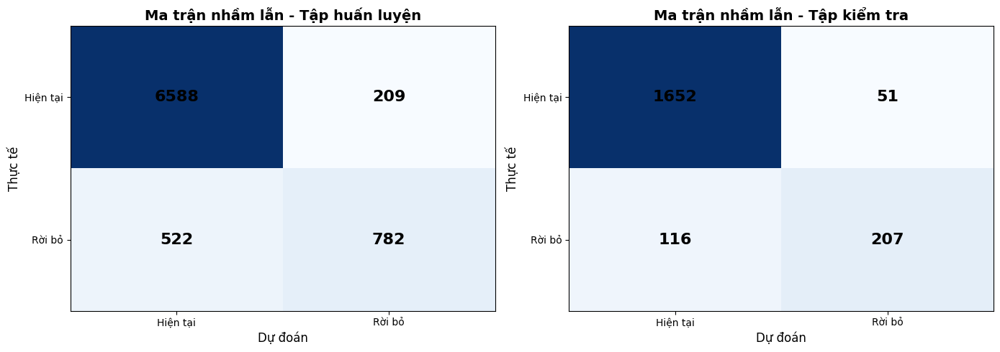
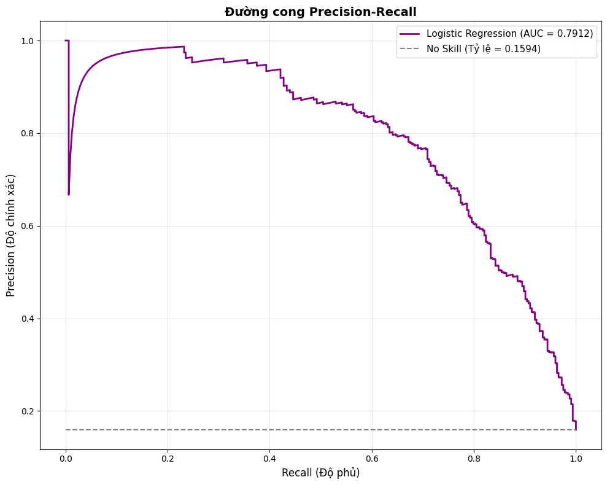
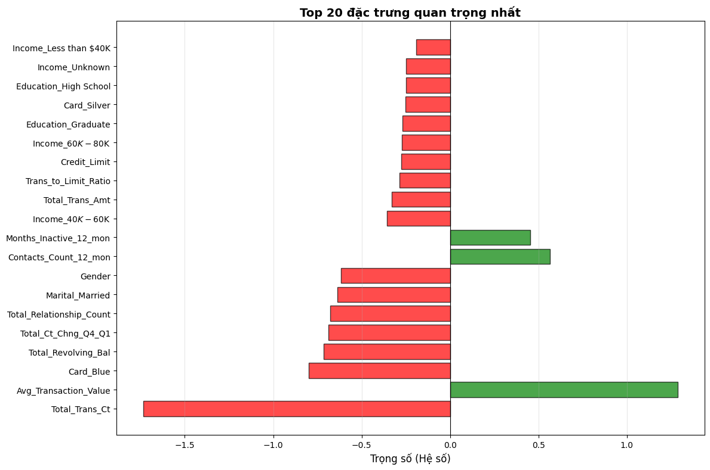

# Bank Customer Churn Prediction

Dự án xây dựng mô hình học máy để dự đoán khả năng rời bỏ của khách hàng (Customer Churn) sử dụng thuật toán Logistic Regression được triển khai từ đầu (from scratch) với thư viện NumPy.

## Mục lục
- [Giới thiệu](#giới-thiệu)
- [Dataset](#dataset)
- [Method](#method)
- [Installation & Setup](#installation--setup)
- [Usage](#usage)
- [Results](#results)
- [Project Structure](#project-structure)
- [Challenges & Solutions](#challenges--solutions)
- [Future Improvements](#future-improvements)
- [Contributors](#contributors)
- [Contact](#contact)
- [License](#license)

## Giới thiệu

### Mô tả bài toán
Trong lĩnh vực ngân hàng, việc giữ chân khách hàng hiện tại tiết kiệm chi phí hơn nhiều so với việc tìm kiếm khách hàng mới. "Customer Churn" là thuật ngữ chỉ việc khách hàng ngừng sử dụng dịch vụ của ngân hàng. Dự án này nhằm mục đích dự đoán những khách hàng có nguy cơ rời bỏ cao dựa trên dữ liệu lịch sử hành vi và nhân khẩu học.

### Động lực và ứng dụng thực tế
- **Tối ưu hóa chi phí:** Giảm chi phí marketing và acquisition.
- **Cải thiện trải nghiệm:** Chủ động đưa ra các ưu đãi hoặc hỗ trợ cho khách hàng có nguy cơ rời bỏ.
- **Hiểu sâu về khách hàng:** Xác định các yếu tố chính dẫn đến quyết định rời bỏ.

### Mục tiêu cụ thể
1. Phân tích và trực quan hóa dữ liệu để tìm ra insight.
2. Xây dựng mô hình Logistic Regression **chỉ sử dụng NumPy** (không dùng scikit-learn cho thuật toán cốt lõi).
3. Đạt hiệu suất dự đoán tốt trên tập dữ liệu kiểm thử, đặc biệt quan tâm đến chỉ số Precision-Recall do dữ liệu mất cân bằng.

## Dataset

### Nguồn dữ liệu
Dữ liệu được sử dụng là bộ **Credit Card Customers** (BankChurners), bao gồm thông tin của khoảng 10,000 khách hàng.
- **File:** `data/raw/BankChurners.csv`

### Mô tả các features
Bộ dữ liệu bao gồm các nhóm đặc trưng chính:
- **Thông tin cá nhân:** `Customer_Age`, `Gender`, `Dependent_count`, `Education_Level`, `Marital_Status`, `Income_Category`.
- **Thông tin tài khoản:** `Card_Category`, `Months_on_book` (thời gian là khách hàng).
- **Hành vi giao dịch:** `Total_Trans_Amt`, `Total_Trans_Ct`, `Total_Revolving_Bal`, `Avg_Open_To_Buy`.
- **Mức độ tương tác:** `Total_Relationship_Count`, `Months_Inactive_12_mon`, `Contacts_Count_12_mon`.

### Kích thước và đặc điểm
- **Số lượng mẫu:** ~10,127 dòng.
- **Số lượng đặc trưng:** 21 cột (trước khi xử lý).
- **Target:** `Attrition_Flag` (Existing Customer vs Attrited Customer).
- **Tỷ lệ Churn:** Khoảng 16% (Dữ liệu mất cân bằng).

## Method

### Quy trình xử lý dữ liệu
1. **Data Cleaning:** Xử lý giá trị 'Unknown', loại bỏ các cột không cần thiết.
2. **Feature Engineering:**
   - Mã hóa biến phân loại (One-Hot Encoding).
   - Chuẩn hóa dữ liệu số (Z-score Normalization).
   - **Feature Selection:** Loại bỏ `Avg_Open_To_Buy` do tương quan cao (1.0) với `Credit_Limit`.
3. **Data Splitting:** Chia tập Train/Test (80/20).

### Thuật toán sử dụng: Logistic Regression
Mô hình được xây dựng dựa trên nền tảng toán học:

1.  **Hàm Sigmoid (Activation Function):**
    $\sigma(z) = \frac{1}{1 + e^{-z}}$

2.  **Hàm giả thuyết (Hypothesis):**
    $h_\theta(x) = \sigma(\theta^T x + b)$

3.  **Hàm mất mát (Binary Cross-Entropy Loss):**
    $J(\theta) = -\frac{1}{m} \sum_{i=1}^{m} [y^{(i)} \log(h_\theta(x^{(i)})) + (1-y^{(i)}) \log(1-h_\theta(x^{(i)}))]$

4.  **Cập nhật trọng số (Gradient Descent):**
    $\theta_j := \theta_j - \alpha \frac{\partial J}{\partial \theta_j}$
    
    $b := b - \alpha \frac{\partial J}{\partial b}$

### Giải thích cách implement bằng NumPy
- **Vectorization:** Sử dụng `np.dot` và `np.einsum` để thực hiện các phép nhân ma trận thay vì vòng lặp `for`, giúp tăng tốc độ tính toán đáng kể.
- **Numerical Stability:**
    - Sử dụng `np.clip` cho hàm sigmoid để tránh tràn số (overflow).
    - Thêm `epsilon` (1e-8) vào hàm log để tránh lỗi `log(0)`.

## Installation & Setup

1.  **Clone project:**
    ```bash
    git clone <project_url>
    cd Code-DS-homework-02-project
    ```

2.  **Tạo môi trường ảo (Khuyến nghị):**
    ```bash
    python -m venv venv
    source venv/bin/activate  # Trên Windows: venv\Scripts\activate
    ```

3.  **Cài đặt thư viện:**
    ```bash
    pip install -r requirements.txt
    ```

## Usage

Dự án được chia thành 3 notebook chính, cần chạy theo thứ tự:

1.  **`notebooks/01_data_exploration.ipynb`**:
    - Khám phá dữ liệu, kiểm tra giá trị thiếu, phân tích đơn biến.
    - Đầu ra: Hiểu biết sơ bộ về dữ liệu.

2.  **`notebooks/02_visualization.ipynb`**:
    - Trực quan hóa chuyên sâu, phân tích tương quan.
    - Thực hiện Feature Selection (loại bỏ biến đa cộng tuyến).
    - Đầu ra: Các file `.npy` trong `data/processed/`.

3.  **`notebooks/03_modeling.ipynb`**:
    - Load dữ liệu đã xử lý.
    - Huấn luyện mô hình Logistic Regression (NumPy).
    - Đánh giá mô hình và phân tích kết quả.

## Results

### Kết quả đạt được (Metrics)
Mô hình được đánh giá trên tập kiểm thử (Test Set) với các chỉ số:
- **Accuracy:** Đánh giá độ chính xác tổng thể.
- **Precision & Recall:** Quan trọng để đánh giá khả năng phát hiện khách hàng rời bỏ.
- **F1-Score:** Trung bình điều hòa của Precision và Recall.
- **PR AUC (Precision-Recall Area Under Curve):** Chỉ số chính được sử dụng thay cho ROC AUC do dữ liệu mất cân bằng.

### Hình ảnh trực quan hoá

#### 1. Confusion Matrix
Cho thấy số lượng dự đoán đúng/sai cụ thể cho từng lớp.


#### 2. Precision-Recall Curve
Biểu diễn sự đánh đổi giữa Precision và Recall ở các ngưỡng khác nhau. Đường cong càng gần góc trên bên phải thì mô hình càng tốt.


#### 3. Feature Importance
Biểu đồ trọng số của các đặc trưng, giúp xác định yếu tố nào ảnh hưởng nhất đến Churn (ví dụ: `Total_Trans_Ct`, `Total_Relationship_Count`).


## Project Structure

```
Code-DS-homework-02-project/
├── data/
│   ├── raw/                    # Dữ liệu gốc (BankChurners.csv)
│   └── processed/              # Dữ liệu đã qua xử lý (.npy files)
├── notebooks/
│   ├── 01_data_exploration.ipynb   # Làm sạch và khám phá dữ liệu
│   ├── 02_visualization.ipynb      # Trực quan hóa và chọn lọc đặc trưng
│   └── 03_modeling.ipynb           # Cài đặt và huấn luyện mô hình
├── requirements.txt            # Các thư viện cần thiết
└── README.md                   # Tài liệu dự án
```

## Challenges & Solutions

### Khó khăn gặp phải khi dùng NumPy
1.  **Tốc độ tính toán:** Vòng lặp Python thuần túy rất chậm khi tính toán Gradient Descent trên tập dữ liệu lớn.
    -   *Giải pháp:* Sử dụng **Vectorization** triệt để với `numpy`.
2.  **Lỗi tràn số (Numerical Instability):** Hàm `exp(-z)` trong Sigmoid có thể gây tràn số với giá trị z lớn/nhỏ, và `log(0)` gây lỗi trong hàm Loss.
    -   *Giải pháp:* Sử dụng `np.clip` để giới hạn giá trị đầu vào và thêm hằng số nhỏ `epsilon`.
3.  **Quản lý kích thước ma trận:** Dễ nhầm lẫn chiều (dimension) khi nhân ma trận (dot product).
    -   *Giải pháp:* Kiểm tra kỹ `shape` của mảng và sử dụng `np.einsum` để kiểm soát rõ ràng các chỉ số (indices).

## Future Improvements
- **Thử nghiệm mô hình khác:** Triển khai Random Forest hoặc Neural Network để so sánh hiệu suất.
- **Hyperparameter Tuning:** Tự động hóa việc tìm learning rate và số vòng lặp tối ưu.
- **Cân bằng dữ liệu:** Áp dụng kỹ thuật SMOTE hoặc Undersampling để xử lý vấn đề mất cân bằng dữ liệu tốt hơn.

## Contributors
- **Phi Anh Khôi** - *Developer & Data Analyst*

## Contact
Mọi thắc mắc xin liên hệ: pakhoi23@clc.fitus.edu.vn
## License
Dự án này được cấp phép theo giấy phép [MIT License](LICENSE).
